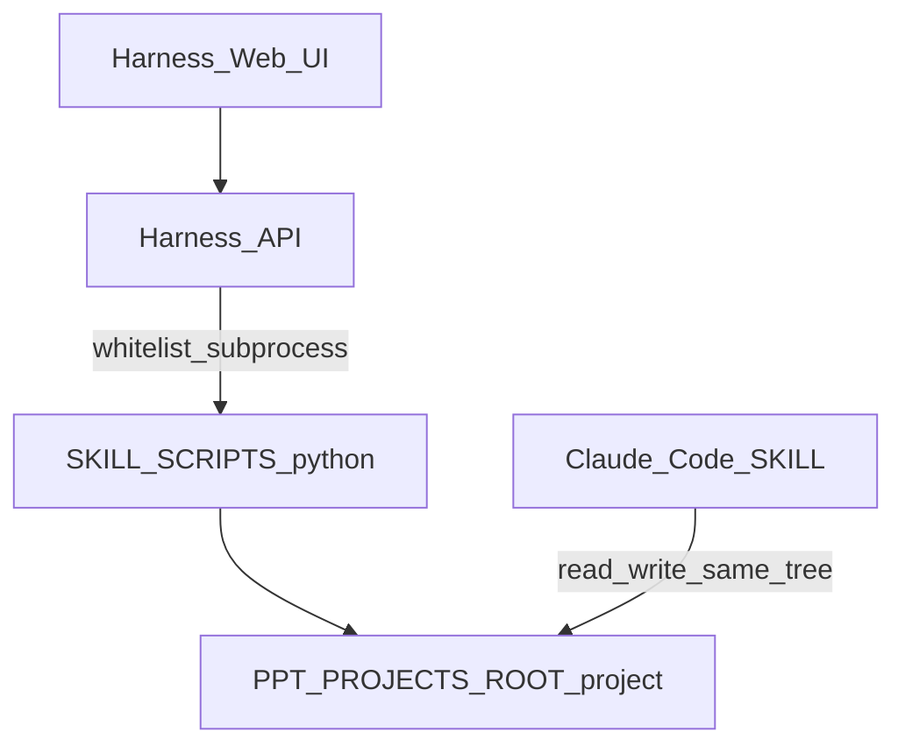

# Harness 架构说明

本文描述 **控制面（Harness Web）** 与 **数据面（项目目录 + Python 工具链）** 的边界。实现代码时以此为契约；未实现部分以「规划」标明。

## 术语

| 术语 | 含义 |
|------|------|
| `REPO_ROOT` | 本 Git 仓库根目录（`pptmaster/`） |
| `SKILL_SCRIPTS` | `REPO_ROOT/skills/ppt-master/scripts` |
| `PPT_PROJECTS_ROOT` | 用户项目根目录，默认 `REPO_ROOT/projects`；须与 `project_manager` 使用的 `base_dir` 一致 |
| SSOT | 单一事实来源；项目内容以磁盘上 `PPT_PROJECTS_ROOT/<project>/` 为准 |

## 逻辑结构

## 路径与环境变量

| 变量 | 必填 | 说明 |
|------|------|------|
| `REPO_ROOT` | 推荐 | 解析 `SKILL_SCRIPTS`；可由进程工作目录或配置推断 |
| `PPT_PROJECTS_ROOT` | 可选 | 默认 `{REPO_ROOT}/projects` |
| Python | 必填 | 与仓库 [requirements.txt](../../requirements.txt) 一致，用于执行脚本 |

实现时须将「项目 ID」解析为 **`PPT_PROJECTS_ROOT` 下的真实子目录**，并校验路径不越界（参考 `project_manager.py` 中 `is_within_path` 思路）。

## 子进程白名单（规划）

**禁止**将任意用户字符串拼进 `shell=True` 或等价物。仅允许调用固定入口，参数为「已校验的项目路径」及文档规定的少量 flag。

### 项目管理

| 用途 | 可执行 | 示例参数（示意） |
|------|--------|------------------|
| 初始化 | `python` | `SKILL_SCRIPTS/project_manager.py init <name> --format ppt169` |
| 导入素材 | `python` | `SKILL_SCRIPTS/project_manager.py import-sources <project_path> ...`（Web 侧默认 **copy**，避免误用 `--move` 破坏上传临时语义） |
| 校验 | `python` | `SKILL_SCRIPTS/project_manager.py validate <project_path>` |
| 信息 | `python` | `SKILL_SCRIPTS/project_manager.py info <project_path>` |

### 源文档转换（按类型择一）

| 用途 | 脚本 |
|------|------|
| PDF | `SKILL_SCRIPTS/source_to_md/pdf_to_md.py` |
| Office / Pandoc 链 | `SKILL_SCRIPTS/source_to_md/doc_to_md.py` |
| PPTX 源 | `SKILL_SCRIPTS/source_to_md/ppt_to_md.py` |
| 网页 | `SKILL_SCRIPTS/source_to_md/web_to_md.py` |
| 微信等 | `SKILL_SCRIPTS/source_to_md/web_to_md.cjs`（需 **Node**） |

### 图片（可选）

| 用途 | 脚本 |
|------|------|
| 分析图 | `SKILL_SCRIPTS/analyze_images.py <project>/images` |
| 生图 | `SKILL_SCRIPTS/image_gen.py`（读 `.env`） |

### Step 7 导出链（顺序固定）

须 **依次** 执行三步；**禁止**合并为一条未经验证的 shell 串联（与 SKILL 一致）。

1. `python SKILL_SCRIPTS/total_md_split.py <project_path>`
2. `python SKILL_SCRIPTS/finalize_svg.py <project_path>`
3. `python SKILL_SCRIPTS/svg_to_pptx.py <project_path> -s final`

## API 与文件系统边界（规划）

- **读**：列出 `PPT_PROJECTS_ROOT` 下项目、读取文本/Markdown、提供 `svg_final/` 静态预览、`exports/` 下载。
- **写**：上传文件到临时区再归入 `sources/`；保存 `design_spec.md` 草稿；**不**在 Harness 内生成逐页 SVG（由 Claude Code 完成）。
- **静态资源**：预览应对项目根目录做路径校验，仅服务白名单子路径。

## 错误与日志

- 子进程 **stdout/stderr** 应完整捕获；长任务建议 **SSE/WebSocket** 推日志（MVP 可用轮询）。
- 失败时返回：退出码、末尾若干行日志、对应 SKILL/文档链接（如 Step 7 顺序错误见 [SKILL.md](../../skills/ppt-master/SKILL.md)）。

## 与 `docs/technical-design.md` 的关系

仓库 [technical-design.md](../../docs/technical-design.md) 描述 **PPT Master 内容管线**（AI→SVG→DrawingML）。Harness 是在其之上的 **操作壳**：不改变管线原理，只封装命令与文件操作。

## 前端 / 后端目录（已定稿）

采用 **方案 A**：所有可运行代码置于 [`harness/app/`](../app/README.md) 下，与文档、仓库根解耦。

| 路径 | 说明 |
|------|------|
| [`harness/app/frontend/`](../app/README.md) | Vite + React + TypeScript + Tailwind（Harness Web UI） |
| [`harness/app/backend/`](../app/README.md) | FastAPI：环境探测、白名单子进程、上传与静态文件下载 |

开发时前端通过 Vite 代理将 `/api` 转发至后端；部署时可由后端挂载前端构建产物或分端口服务。详细启动方式见 [harness/README.md](../README.md)。
